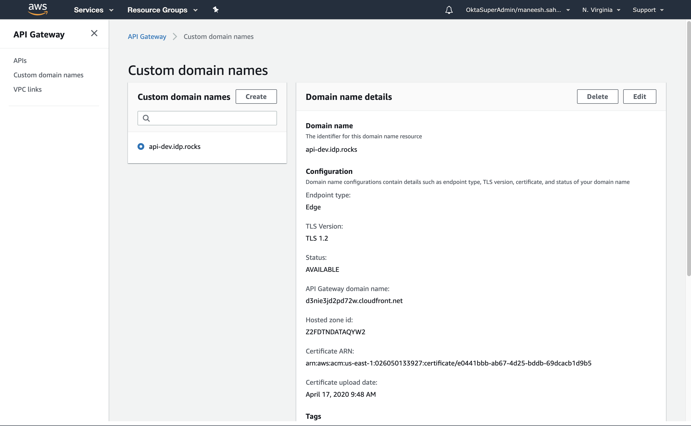

ℹ️ Disclaimer: This project is community-supported and is maintained by members of the Okta team for developers and other IT professionals. DAC is not an official Okta product and does not qualify for any Okta support. Okta makes no warranties regarding this project. Anyone who chooses to use this project must ensure that their implementation meets any applicable legal obligations including any Okta terms and conditions.

ℹ️ It is recommended that you collaborate with your preferred [Okta Solution Provider](https://www.okta.com/partners/meet-our-partners/?field_partner_type_tid=8101&field_solutions_target_id=6061) to implement and adapt this app code sample within your existing portal. This app features frontend and backend components and like any web app hosted and running on your side, you should perform a code review, as well as security and scalability tests. 

Link to the main DAC project: https://github.com/oktadeveloper/okta-dac

# DAC - Domains API

## Pre-requisites

- npm
- serverless
- aws account (create profile - udp-admin)
- java (to run dynamodb on local stack)

## Local Stack

Test your service locally, without having to deploy it first.

1. Install dependencies
2. Installl dynamodb/local stack
3. Start serverless-offline

### Run service offline

Make sure to set `IS_OFFLINE` to `true`. If you don't set this environment variable, then lambda functions will attempt to use the dynamo DBs running in your AWS instance.

```bash
export IS_OFFLINE=true
npm install
serverless dynamodb install
serverless offline start
```

```bash


```

## AWS Stack

Create an AWS profile `udp-admin` on your computer.

If you want a custom-domain for your API endpoints configure in AWS API Gateway, edit `serverless.yml` and set the custom domain section.

The customDomain config ends up configuring `api-dev.idp.rocks` (for the dev stage). You can make it `api.<your domain>` or `anything.<your domain>` as you want it. Just make sure to 'Request a public certificate' in AWS Certificate Manager with the same domain name.
See this guide for more information: https://serverless.com/blog/serverless-api-gateway-domain/

```yml
customDomain:
  domainName: api-${self:provider.stage}.idp.rocks
  basePath: ""
  stage: ${self:provider.stage}
  createRoute53Record: false
```

Next, run

```bash
serverless create_domain -v
```

This will create a custom domain in your API Gateway.

```bash
Serverless: Skipping creation of Route53 record.
Serverless: Custom domain api.<mydomain> was created.
            New domains may take up to 40 minutes to be initialized.
```

This was created with the default setup:


Once the domain name is ready, run deploy to deploy the services (API Gateway, Lambda Functions, Authorizers, DynamoDB) in your AWS instance:

```bash
serverless deploy -v
```

```bash
...
Service Information
service: okta-domains
stage: dev
region: us-east-1
stack: okta-domains-dev
resources: 63
api keys:
  None
endpoints:
  POST - https://eynphk7c6h.execute-api.us-east-1.amazonaws.com/dev/domains
  GET - https://eynphk7c6h.execute-api.us-east-1.amazonaws.com/dev/domains/{domain}
  DELETE - https://eynphk7c6h.execute-api.us-east-1.amazonaws.com/dev/domains/{domain}
  GET - https://eynphk7c6h.execute-api.us-east-1.amazonaws.com/dev/domains
  GET - https://eynphk7c6h.execute-api.us-east-1.amazonaws.com/dev/.well-known/webfinger
  POST - https://eynphk7c6h.execute-api.us-east-1.amazonaws.com/dev/verifications
  PUT - https://eynphk7c6h.execute-api.us-east-1.amazonaws.com/dev/verifications/{domain}
  GET - https://eynphk7c6h.execute-api.us-east-1.amazonaws.com/dev/verifications/{domain}
  DELETE - https://eynphk7c6h.execute-api.us-east-1.amazonaws.com/dev/verifications/{domain}
functions:
  addDomain: okta-domains-dev-addDomain
  getDomain: okta-domains-dev-getDomain
  removeDomain: okta-domains-dev-removeDomain
  listDomains: okta-domains-dev-listDomains
  webfinger: okta-domains-dev-webfinger
  createVerification: okta-domains-dev-createVerification
  checkVerification: okta-domains-dev-checkVerification
  getVerification: okta-domains-dev-getVerification
  deleteVerification: okta-domains-dev-deleteVerification
layers:
  None

Serverless Domain Manager Summary
Distribution Domain Name
  Target Domain: d3nie3jd2pd72w.cloudfront.net
  Hosted Zone Id: Z2FDTNDATAQYW2
Serverless: Run the "serverless" command to setup monitoring, troubleshooting and testing.
```

Make Sure to create a DNS CNAME Alias for your custom domain to the Distribution Domain. In the case above, `api-dev.idp.rocks` --> `d3nie3jd2pd72w.cloudfront.net`

Once the DNS changes propagate, you can start using the API with your own domain.

## Usage

You can create, retrieve, update, or delete todos with the following commands:

### Create a Domain

```bash
curl -X POST -H "Content-Type:application/json" http://localhost:3000/domain --data '{ "domain": "boeing.com", "idp": "idp001" }'
```

Example Result:

```bash
{"domain":"boeing.com","idp":"idp001","created":1479138570824}
```

### List Domains for an Idp

```bash
curl -H "Content-Type:application/json" http://localhost:3000/domains?idp={idp}
```

Example output:

```bash
[{ "domain": "boeing.com", "idp": "idp001","created":1479138570824 }]
```

### Perform a Webfinger

```bash
# Replace the resource with an email address
curl -H "Content-Type:application/json" http://localhost:3000/.well-known/webfinger?resource={email}
```

Example Result:

```bash
{
    "subject": "pankaj@jepessen.com",
    "links": [
        {
            "rel": "okta:idp",
            "href": "/sso/idps/idp001",
            "titles": {
                "und": "MTASamlIdp"
            },
            "properties": {
                "okta:idp:metadata": "/api/v1/idps/idp001/metadata.xml",
                "okta:idp:type": "SAML2",
                "okta:idp:id": "idp001"
            }
        }
    ]
}
```

### Delete a Domain

```bash
# Replace the <id> part with a real id from your todos table
curl -X DELETE -H "Content-Type:application/json" http://localhost:3000/domains/{idp}/{domain}/
```

No output
